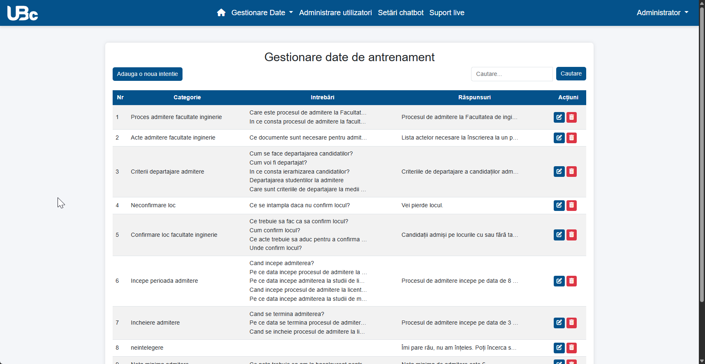

# Aplicatie web de tip chatbot pentru Universitatea "Vasile Alecsandri" din Bacau

## Descrierea proiectului

Acest proiect reprezinta lucrarea mea de licenta, un sistem de chatbot web dezvoltat pentru Universitatea "Vasile Alecsandri" din Bacau. Aplicatia are scopul de a oferi studentilor, cadrelor didactice si vizitatorilor acces rapid la informatii academice si administrative prin intermediul unei interfete conversationale intuitive.

Chatbot-ul poate:
- Raspunde automat la intrebari frecvente despre admitere, examene, burse, etc.
- Intelege intrebari formulate in limbaj natural
- Recunoaste intentia utilizatorului chiar si in prezenta greselilor de scriere
- Conecta utilizatorii cu operatori umani pentru situatii complexe

## Interfata utilizator


Interfata include:
- Fereastra de chat cu bule de mesaje distincte pentru utilizator si chatbot
- Optiuni predefinite organizate pe categorii (Admitere, Taxe, Regulamente, etc.)
- Camp pentru introducerea intrebarilor in limbaj natural
- Posibilitatea de a solicita asistenta umana

## Tehnologii utilizate

### Backend
- Python
- Flask
- TensorFlow/Keras
- SpaCy
- PyMySQL
- Websockets

### Frontend
- HTML/CSS
- JavaScript
- Bootstrap
- AJAX

## Fluxul de functionare al aplicatiei

Aplicatia functioneaza in patru etape principale:
1. **Initializarea sistemului**: Serverul Flask porneste si se conecteaza la baza de date MySQL pentru a incarca datele necesare.
2. **Preprocesarea datelor**: Textele din baza de date sunt curatate si standardizate (eliminarea diacriticelor, lematizare, tokenizare).
3. **Antrenarea modelului**: Reteaua neuronala LSTM este antrenata pentru a recunoaste intentiile utilizatorilor.
4. **Procesarea interactiunii**: Sistemul gestioneaza comunicarea cu utilizatorul, procesand intrebarile si generand raspunsuri adecvate sau conectand utilizatorul cu un operator cand este necesar.


## Cum functioneaza aplicatia

### Procesarea limbajului natural

Preprocesarea datelor este importanta pentru ca sistemul sa inteleaga si sa proceseze corect textul in limba romana. Functia `preprocesare_date()` transforma intrebarile din baza de date in format standardizat pentru antrenarea modelului. Aceasta aplica lematizarea care reduce cuvintele la forma lor de baza (ex: "studentilor" devine "student") si elimina cuvintele de legatura si punctuatia care nu aduc valoare semantica.

```python
def preprocesare_date(self):
    # Procesarea intrebarilor pentru antrenare
    for intent in self.data['categorii_intentii']:
        for pattern in intent['set_intrebari']:
            # Lematizare - reducerea cuvintelor la forma de baza
            doc = nlp(pattern.lower())
            text_tokenizat = [token.lemma_ for token in doc 
                             if not token.is_stop and not token.is_punct]
            
            # Asocierea textului cu categoria de intentie
            date_antrenament.append((text_tokenizat, intent['tag']))
```

### Modelul de retea neuronala

Pentru clasificarea intentiilor utilizatorilor, am implementat o retea neuronala LSTM (Long Short-Term Memory) folosind Keras. Aceasta arhitectura a fost aleasa pentru capacitatea sa de a intelege contextul si dependentele dintre cuvinte in propozitii. Functia `antrenare_model()` construieste o retea cu straturi de embedding, LSTM bidirectional si straturi dense pentru clasificare, optimizand procesul de invatare prin mecanisme precum dropout pentru a preveni supraantrenarea.

```python
def antrenare_model(self):
    model = Sequential([
        # Embedding transforma cuvintele in vectori cu 128 dimensiuni
        Embedding(input_dim=vocab_size, output_dim=128, 
                  input_length=self.lungime_maxima_secventa),
        
        # LSTM bidirectional - citeste textul in ambele directii
        Bidirectional(LSTM(128, return_sequences=True)),
        Dropout(0.5),  # Previne memorarea exacta a exemplelor
        
        LSTM(64, return_sequences=True),
        Dropout(0.5),
        
        LSTM(32),
        
        # Straturi pentru clasificarea finala in categorii de intentii
        Dense(64, activation='relu'),
        Dropout(0.5),
        Dense(len(self.categorii_intentii), activation='softmax')
    ])
```

### Identificarea intentiei utilizatorului

Cand un utilizator trimite o intrebare, sistemul foloseste o abordare hibrida pentru a determina intentia cu precizie maxima. Functia `clasificare()` proceseaza textul si utilizeaza modelul LSTM pentru a evalua probabilitatile pentru fiecare categorie posibila de intentie. Rezultatul acestei clasificari este apoi comparat cu scorurile de similaritate lexicala pentru a lua o decizie finala mai robusta, toleranta la erori de scriere.

```python
# Procesare si clasificare
padded_sequence = self.vectorizare_text(propozitie_procesata)
predictie = self.model.predict(padded_sequence).flatten()
intentie_prezisa = self.categorii_intentii[np.argmax(predictie)]

# Calculul similaritatii cu intrebarile cunoscute
for intent in self.data['categorii_intentii']:
    for pattern in intent['set_intrebari']:
        distanta = Chatbot.distanta_damerau_levenshtein(
            propozitie_procesata, Chatbot.curata_text(pattern))
        scor_similaritate = max(0, len(pattern) - distanta) / len(pattern)
```

### Algoritmul Damerau-Levenshtein

Acest algoritm calculeaza "distanta de editare" dintre doua texte, permitand chatbot-ului sa recunoasca intentia chiar si cand exista greseli de scriere, se omit litere sau se inverseaza caractere. Algoritmul calculeaza numarul minim de operatii (insertii, stergeri, substitutii si transpozitii) necesare pentru a transforma un text in altul.

```python
def distanta_damerau_levenshtein(sir1, sir2):
    # Initializare matrice de distante
    lungime_sir1, lungime_sir2 = len(sir1) + 1, len(sir2) + 1
    distanta = [[0 for _ in range(lungime_sir2)] for __ in range(lungime_sir1)]
    
    # Calculul distantei
    for i in range(1, lungime_sir1):
        for j in range(1, lungime_sir2):
            # Verifica tipul de operatie necesara
            if sir1[i-1] == sir2[j-1]:  # Caractere identice
                cost = 0
            else:  # Caractere diferite - necesita substitutie
                cost = 1
                
            distanta[i][j] = min(
                distanta[i-1][j] + 1,        # Insertie
                distanta[i][j-1] + 1,        # Stergere
                distanta[i-1][j-1] + cost    # Substitutie
            )
            
            # Verifica daca se poate face transpozitie
            if i > 1 and j > 1 and sir1[i-1] == sir2[j-2] and sir1[i-2] == sir2[j-1]:
                distanta[i][j] = min(distanta[i][j], distanta[i-2][j-2] + cost)
```

### Suport live pentru utilizatori

Sistemul implementeaza un mecanism inteligent de redirectare catre operatori umani atunci cand chatbot-ul nu poate raspunde satisfacator. Functia de chat monitorizeaza numarul de intrebari consecutive neinteleasa si, cand acesta depaseste pragul de 3, ofera utilizatorului optiunea de a solicita asistenta live. Acest sistem asigura ca nicio intrebare nu ramane fara raspuns.

```python
# Daca utilizatorul introduce 3 intrebari care nu sunt intelese
if sesiune_browser_useri[id_sesiune_utilizatori]['contor_intrebari_nerecunoscute'] >= 3:
    sesiune_browser_useri[id_sesiune_utilizatori]['contor_intrebari_nerecunoscute'] = 0 
    return jsonify({'raspuns': response, 'arata_optiune_chat_live': True})
```

Comunicarea in timp real intre utilizatori si operatori este implementata folosind Socket.IO, care permite schimbul instantaneu de mesaje. Sistemul creaza camere virtuale pentru fiecare sesiune de utilizator si permite operatorilor sa monitorizeze si sa raspunda la toate conversatiile active.

```python
# Conexiunea dintre utilizator si operator
@socketio.on('mesaj_de_la_admin', namespace='/admin')
def eveniment_msg_admin(data):
    # Trimite mesajul operatorului catre utilizator
    emit('mesaj_de_la_admin', {'data': message}, 
         namespace='/', room=id_sesiune_utilizatori)
```

## Interfata de administrare

Administratorii pot:
- Vizualiza si gestiona intrebarile si raspunsurile din baza de date
- Adauga noi categorii si intrebari pentru antrenarea chatbot-ului
- Monitoriza intrebarile fara raspuns pentru imbunatatirea sistemului
- Personaliza mesajele si aspectul chatbot-ului
- Gestiona conturi de operatori pentru suportul live



Panoul de administrare permite personalizarea interfetei chatbot-ului si gestionarea bazei de date cu intrebari si raspunsuri.

